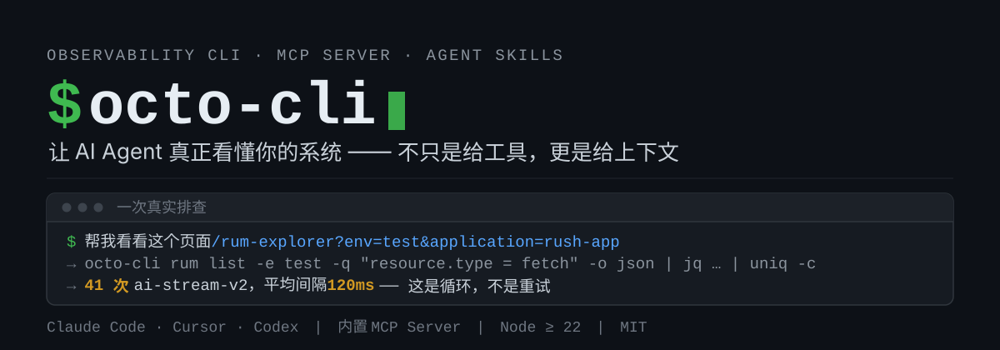
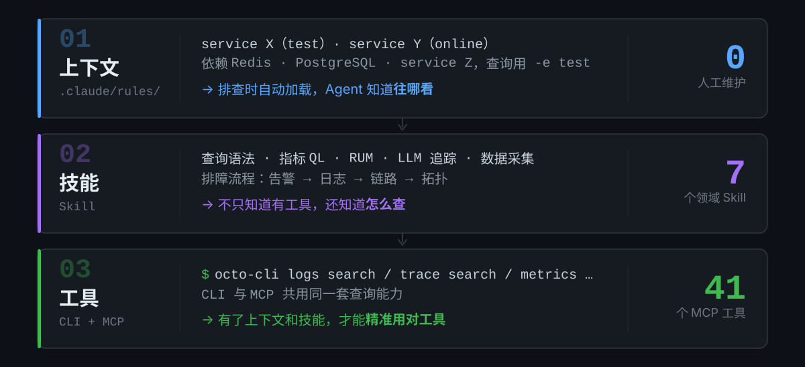

<p align="center">
  
</p>

<p align="center">
  <a href="https://www.npmjs.com/package/octo-cli"></a>
  <a href="https://opensource.org/licenses/MIT"></a>
  
</p>

## 一次真实排查

你在 Octopus RUM 页面看到某个项目的 fetch 请求异常多，把 URL 原样贴给 Agent：

```text
> 帮我看看这个页面的数据
> https://octopus.zhenguanyu.com/#/rum-explorer?env=test&rumExplorerQuery=
> ei81ddb36uku%20AND%20resource.type%20%3D%20fetch&rumExplorerQueryEventType=
> resource&rumExplorerSelectedApplication=rush-app&time=1d
```

Agent 解析 URL 参数，转成 octo-cli 命令，统计请求频次：

```bash
$ npx octo-cli rum list -e test \
    -q "application.name = rush-app AND resource.type = fetch AND ei81ddb36uku" \
    -l 1d -n 500 -o json \
    | jq '.rumItems[].event.resource.url' | sort | uniq -c | sort -rn | head -10

     41 "GET /api/ai-stream-v2?projectId=ei81ddb36uku&..."
     38 "GET /api/ai-stream/heart?projectId=ei81ddb36uku"
     37 "POST /api/chat/ei81ddb36uku/.../generate-title"
      8 "POST /api/chat/ei81ddb36uku/conversations/..."
      4 "GET /api/projects"
      3 "GET /api/version/list"
#    ^^^ 三个接口 40 次 vs 正常请求 3-8 次，明显异常
```

接着自己深挖时间分布，确认是循环而不是重试：

```bash
$ npx octo-cli rum list -e test \
    -q "application.name = rush-app AND resource.type = fetch AND ei81ddb36uku" \
    -l 1d -n 500 -o json \
    | jq '[.rumItems[] | select(.event.resource.url | contains("ai-stream-v2"))
           | .timestamp] | sort | [range(1;length) as $i
           | .[$i] - .[$i-1]] | (add / length)'
#  → 平均间隔 120ms，集中在 3 秒内，这是循环不是重试

$ # Agent 定位到代码：chat-view.tsx
$ # useChat resume → 流结束 → onFinish → generateTitle + 刷新状态 → transport 重建 → 再次 resume
$ # 根因：resume 机制 + onFinish 回调 + 状态刷新形成无限循环
```

**从贴 URL 到定位根因，一次对话。** 你在页面上看到「这个项目请求数量不对」，Agent 用同一份数据确认了你的直觉，然后做了你不想手动做的事：统计频次、分析时间分布、追到代码里找出循环。

## 为什么不是「给 Agent 几个查询工具」就够了

给 AI Agent 几个可观测工具（查日志、查指标），然后期望它能排查生产问题，就像给人一个望远镜让他在城市里找路 —— 工具能用，但不知道往哪看。

可观测数据又多又杂：日志、链路、指标、告警、RUM、LLM Span、错误追踪、服务拓扑……分散在不同服务、不同环境、不同命名规则里。Agent 不知道「这个项目跑了哪些服务」「该查哪个环境」「上下游依赖是谁」，要么反复问你，要么瞎猜。

octo-cli 的解法是三层结构：**上下文**（这个项目跑了什么、依赖谁、该查哪个环境）→ **技能**（查询语法、排障流程）→ **工具**（CLI 命令与 43 个 MCP 工具）。三层齐了，才是「Agent 会 grep 日志」和「Agent 能排查问题」之间的差距。

<p align="center">
  
</p>

上下文文件不是手写的 —— Agent 通过**代码分析**（SDK 导入、服务配置）和**线上链路数据**（真实拓扑、入口、依赖）自动生成。链路数据反映的是生产环境实际在跑什么，比看代码靠谱。

**持续保鲜** —— 上下文不是一次性快照。项目在演进，Agent 在日常排查中如果发现数据和上下文对不上（新 service 出现、拓扑变了、接入了新 SDK、Issue 变了），会当场更新上下文文件。不需要人维护，Agent 自己保鲜。

## 快速开始

```bash
# 一条命令完成所有准备（保存凭证 + 全局安装 Skill）
npx octo-cli login --token <YOUR_PERSONAL_ACCESS_TOKEN>
```

> Token 获取方式：Octopus Web 页面左下角用户菜单 →「Access Token」→ 创建，复制 `oct_pat_xxx`。

然后在任意项目里，对 AI Agent 说 **「帮我接入 Octopus 可观测」**，Agent 会自动完成：

1. 运行 `npx octo-cli init`（生成上下文模板 + 安装项目 Skill）
2. 扫描代码（服务名、SDK、配置、环境变量）
3. 查询线上 Octopus 数据（链路拓扑、入口、RUM、Issue）
4. 把可观测上下文写入 `.claude/rules/octopus-observability.md`

此后这个项目里的所有 Agent 会话都会自动加载该上下文。生成的文件会告诉 Agent：项目部署了哪些服务、分别在什么环境、接入了哪些数据采集、服务拓扑和上下游依赖、用实际服务名填好的查询命令、已知问题和监控查询。

## 页面 URL 即查询入口

你在 Octopus 页面上看到一个问题，想让 Agent 帮你分析 —— 不需要翻译成查询语句，直接把 URL 贴给它（[上面的排查案例](#一次真实排查)就是这么开始的）。

Octopus 的 URL 参数是语义化的（`env`、`query`、`time`、`application`），Agent 天然能读懂，不需要额外代码。日志页面、链路页面、RUM 页面、告警页面、大盘页面 —— 任何 Octopus URL 都能直接贴。

这个能力的价值在于：**你在页面上看到的和 Agent 查到的是同一份数据。** 你和 Agent 之间有了共同的「指向能力」—— 你指着页面说「这里有问题」，Agent 立刻能看到同一个视角的数据，然后用它擅长的方式（关联日志、追踪链路、聚合分析）去深挖。

## 命令

所有查询命令共享这些选项：

| 选项 | 说明 | 示例 |
|------|------|------|
| `-l, --last <duration>` | 相对时间范围 | `15m`、`1h`、`2d`、`1w` |
| `--from` / `--to <time>` | 绝对时间 | 毫秒时间戳或 ISO 字符串 |
| `-e, --env <env>` | 环境 | `online`、`test` |
| `-q, --query <query>` | 查询语句 | `level = ERROR` |
| `-o, --output <fmt>` | 输出格式 | `json`、`table`、`jsonl` |
| `-n, --limit <n>` | 最大返回条数 | `50` |

```bash
octo-cli logs search -q "level = ERROR" -l 15m       # 搜索日志
octo-cli alerts search -s firing -p P0,P1 -l 1h      # 正在触发的 P0/P1 告警
octo-cli trace aggregate -a "duration:p95" -g service # 按服务聚合 P95 延迟
octo-cli services topo myapp                          # 服务拓扑图
```

<details>
<summary><b>按领域展开全部命令</b></summary>

### 日志

```bash
octo-cli logs search -q "level = ERROR" -l 15m          # 搜索日志
octo-cli logs search -q "service = myapp" --last 1h -n 100
octo-cli logs search --from 2024-01-01T00:00:00Z --to 2024-01-01T01:00:00Z

octo-cli logs aggregate -q "level = ERROR" -g service    # 按服务聚合
octo-cli logs aggregate -a "*:count" -g level:5 -l 30m   # 按 level 聚合 Top 5
```

### 告警

```bash
octo-cli alerts search -s firing -p P0,P1 -l 1h           # 正在触发的 P0/P1 告警
octo-cli alerts search --service myapp                    # 某个服务的所有告警（不传 -s 即全部状态）
octo-cli alerts search --rule-type metric -l 1h           # 只看指标类告警
octo-cli alerts detail <alertId>                          # 告警详情（含触发规则与维度）
octo-cli alerts timeseries <alertId> -l 1h                # 告警检测时序数据
octo-cli alerts rules --group-id 123                      # 搜索告警规则
octo-cli alerts rules -e online -p P0,P1                  # 按环境/优先级过滤规则
octo-cli alerts groups                                    # 查询全部告警组
octo-cli alerts rule-details --ids 101,102                # 批量查询规则详情（最多 100 个）
octo-cli alerts create --file rule.json                   # 从 JSON 创建告警规则
octo-cli alerts delete <ruleId>                           # 删除告警规则

# 静默：只抑制某条已触发告警的通知
octo-cli alerts silence --rule-id 1 --alert-id 2 --duration 2h
octo-cli alerts unsilence <ruleId>

# 停用：让规则本身在时间段内不参与检测（不需要 alertId）
octo-cli alerts disable --rule-id 1 --duration 2h --reason "节假日维护"
octo-cli alerts disables <ruleId>                         # 查看该规则的停用记录
octo-cli alerts enable <disableId>                        # 删除停用记录（传停用记录 id）
```

### 错误追踪 (Issue)

```bash
octo-cli issues search --status unresolved -l 1h         # 未解决的 Issue
octo-cli issues detail <issueId>                          # Issue 详情
octo-cli issues assign --user 123 --ids id1,id2          # 分配 Issue
octo-cli issues update --ids id1,id2 -s resolved          # 解决 Issue
octo-cli issues merge --ids id1,id2                       # 合并 Issue，返回 mergeIssueId
octo-cli issues merge-children <issueId>                  # 查询 children 或 canonical parent
octo-cli issues unmerge <mergeIssueId> --ids child1       # 移出 child，可能触发 dissolve
octo-cli issues update --ids id1,id2 -s ignored \
  --ignore-type TIME \
  --ignore-end-time 2026-07-31T23:59:59Z              # 忽略到指定时间

octo-cli issues update --ids id1,id2 -s ignored \
  --ignore-type APPEAR_COUNT \
  --appear-count 100 \
  --start-timestamp 2026-07-06T00:00:00Z \
  --time-window-ms 3600000                            # 在时间窗口内按发生次数忽略

octo-cli issues update --ids id1,id2 -s ignored \
  --source log \
  --ignore-type USER_COUNT \
  --user-count 50 \
  --user-field uid \
  --start-timestamp 2026-07-06T00:00:00Z \
  --time-window-ms 3600000                            # 在时间窗口内按影响用户数忽略

octo-cli issues update --ids id1,id2 -s unresolved       # 取消忽略
```

### Case

```bash
octo-cli cases list --status todo --priority P1           # 待处理 Case
octo-cli cases create --name "线上故障" --group-id 1 --priority P0
octo-cli cases detail <caseId>                            # Case 详情
octo-cli cases link <caseId> --type alert --target-id 123 # 关联告警
octo-cli cases note <caseId> --text "已通知负责人"          # 添加备注
```

### 链路 (Trace) / 指标 (Metrics)

```bash
octo-cli trace search -q "service = myapp" -l 15m        # 搜索 Span
octo-cli trace aggregate -a "duration:p95" -g service     # 按服务聚合 P95 延迟

octo-cli metrics query "sum(http_requests{}.as_count)" -l 1h       # 时序查询
octo-cli metrics query "avg(cpu_usage{service=myapp})" --points 50  # 指定数据点数
octo-cli metrics point "sum(error_count{}.as_count)"                 # 单点查询
```

### 服务 / LLM / RUM / 事件 / 用户

```bash
octo-cli services list -l 1h                              # 列出活跃服务
octo-cli services entries myapp -l 1h                     # 服务入口列表
octo-cli services topo myapp                              # 服务拓扑图

octo-cli llm -l 1h -q "model.name = gpt-4"              # LLM 可观测
octo-cli rum list -e test -q "application.name = myapp" -l 1d   # RUM 会话
octo-cli rum detail <id>                                  # RUM 事件详情
octo-cli rum aggregate -q "type = view" -a "*:count" -g "view.name:10" -l 1h
octo-cli events -l 1d                                     # 部署事件
octo-cli events aggregate -a "*:count" -g "type:10" -l 1d
octo-cli users alice bob                                  # 按姓名搜索用户
```

</details>

<details>
<summary><b>命令速查表</b></summary>

| 命令 | 说明 |
|------|------|
| `login` | 配置凭证 + 全局安装 Skill |
| `init` | 项目接入：生成上下文模板 + 安装 Skill |
| `logs search` / `logs aggregate` | 搜索日志 / 日志聚合 |
| `alerts search` / `alerts rules` | 搜索告警 / 搜索告警规则 |
| `alerts detail` / `alerts timeseries` | 告警详情 / 检测时序数据 |
| `alerts groups` / `alerts rule-details` | 查询告警组 / 批量查询告警规则详情 |
| `alerts create` / `alerts delete` | 从 JSON 创建 / 删除告警规则 |
| `alerts silence` / `alerts unsilence` | 创建 / 解除告警静默（抑制单条告警通知） |
| `alerts disable` / `alerts disables` / `alerts enable` | 停用规则 / 查看停用记录 / 删除停用记录 |
| `issues search` / `issues detail` | 搜索 Issue / Issue 详情 |
| `issues assign` / `issues update` | 批量分配 / 批量更新 Issue 状态 |
| `issues merge` / `issues unmerge` / `issues merge-children` | 合并 / 移出 child / 查询合并关系 |
| `cases list` / `cases create` | 查询 / 创建 Case |
| `cases detail` / `cases detail-key` | Case 详情 |
| `cases update` / `cases delete` | 更新或删除 Case |
| `cases link` / `cases unlink` | 关联或取消关联告警/Issue |
| `cases note` / `cases note-update` | 添加或修改 Case 备注 |
| `cases groups` / `cases group-create` | 查询或创建 Case 分组 |
| `trace search` / `trace aggregate` | 搜索链路 Span / 链路聚合 |
| `metrics query` / `metrics point` | 指标时序查询 / 单点查询 |
| `services list` / `services entries` / `services topo` | 服务列表 / 入口列表 / 拓扑图 |
| `llm` | LLM Span 查询 |
| `rum list` / `rum detail` / `rum aggregate` | RUM 事件列表 / 详情 / 聚合 |
| `events` / `events list` / `events aggregate` | 事件查询 / 聚合（`list` 为默认子命令） |
| `users` | 用户搜索 |
| `mcp` / `mcp-install` | 启动 MCP Server / 一键注册到 Claude Code |

</details>

## Unix 管道

所有命令输出到 stdout，支持 `json` 和 `jsonl` 两种格式，天然适配 `jq`、`grep`、`sort`、`awk`。这不是附加功能，而是核心设计 —— 可观测数据的价值在于**组合和关联**，而不是一条条孤立地看。

```bash
# 按 ERROR 数量排序找出最严重的服务
octo-cli logs aggregate -q "level = ERROR" -g service:10 -l 1h -o json \
  | jq -r '.[] | select(.fields.service) | "\(.values["count(*)"]) \(.fields.service)"' \
  | sort -rn

# 告警 → 提取 service tag → 去重
octo-cli alerts search -s firing -l 1h -o json | jq -r '.[].tags[]?' | grep 'service:' | sort -u

# 逐条告警带优先级格式化
octo-cli alerts search -s firing -l 1h -o jsonl | jq -r '"[\(.priority)] \(.title)"'

# Issue 里 grep Redis 相关错误
octo-cli issues search --status unresolved -e test -l 7d -o json \
  | jq -r '.issues[].errorMsg' | grep -i redis

# 找出最慢的 API 请求
octo-cli trace search -q "service = myapp AND operation = http.server" -l 1h -n 50 -o json \
  | jq -r '.spanItems[] | "\(.duration)ms \(.name)"' | sort -rn | head -10
```

Agent 也是这么用的 —— 把输出 pipe 到 `jq` 做二次提取、pipe 到 `sort` 排序、pipe 到 `grep` 过滤。CLI 输出越干净，Agent 的组合能力越强。

## MCP Server

内置 stdio MCP Server，43 个工具，支持 Claude Code、Cursor 等 AI Agent 直接调用。

```bash
# 前提：已执行 octo-cli login
npx octo-cli mcp-install
```

自动读取已保存的 Personal Access Token 并注册到 Claude Code。也可以手动配置：

```json
{
  "mcpServers": {
    "octo-mcp": {
      "command": "npx",
      "args": ["-y", "octo-cli", "mcp"],
      "env": {
        "OCTOPUS_TOKEN": "<your-personal-access-token>"
      }
    }
  }
}
```

<details>
<summary><b>MCP 工具列表</b></summary>

| 工具 | 说明 |
|------|------|
| `octo_logs_search` / `octo_logs_aggregate` | 搜索日志 / 日志聚合 |
| `octo_alerts_search` / `octo_alerts_rules_search` | 搜索告警 / 搜索告警规则 |
| `octo_alerts_detail` / `octo_alerts_timeseries` | 告警详情 / 检测时序数据 |
| `octo_alerts_groups_list` / `octo_alerts_rules_details_search` | 查询告警组 / 批量查询告警规则详情 |
| `octo_alerts_rules_create` / `octo_alerts_rules_delete` | 创建 / 删除告警规则 |
| `octo_alerts_silence_create` / `octo_alerts_silence_delete` | 创建 / 解除告警静默（抑制单条告警通知） |
| `octo_alerts_rule_disable_create` | 停用告警规则（规则本身不再检测） |
| `octo_alerts_rule_disable_list` / `octo_alerts_rule_disable_delete` | 查看 / 删除停用记录 |
| `octo_issues_search` / `octo_issues_detail` | 搜索 Issue / Issue 详情 |
| `octo_issues_assign` / `octo_issues_update` | 批量分配 / 批量更新 Issue |
| `octo_issues_merge` / `octo_issues_unmerge` | 合并 Issue / 从 merge Issue 移出 child |
| `octo_issues_merge_children` | 查询 merge children 或 frozen child 的 canonical parent |
| `octo_cases_list` / `octo_cases_create` | 查询 / 创建 Case |
| `octo_cases_detail` / `octo_cases_detail_by_key` | Case 详情 |
| `octo_cases_update` / `octo_cases_delete` | 更新或删除 Case |
| `octo_cases_link` / `octo_cases_unlink` | 关联或取消关联告警/Issue |
| `octo_cases_note_add` / `octo_cases_note_update` | 添加或修改 Case 备注 |
| `octo_cases_groups_all` / `octo_cases_group_create` | 查询或创建 Case 分组 |
| `octo_trace_search` / `octo_trace_aggregate` | 搜索链路 Span / 链路聚合 |
| `octo_metrics_query` / `octo_metrics_point` | 指标时序 / 单点查询 |
| `octo_services_list` / `octo_services_entries` / `octo_services_topology` | 服务列表 / 入口 / 拓扑 |
| `octo_llm_list` | LLM Span 查询 |
| `octo_rum_list` / `octo_rum_detail` / `octo_rum_aggregate` | RUM 事件查询 / 详情 / 聚合 |
| `octo_events_list` / `octo_events_aggregate` | 事件查询 / 聚合 |
| `octo_users_search` | 用户搜索 |

</details>

## 配套 Skill

面向特定 Octopus 领域的深度知识，`login` 和 `init` 时自动安装，也可单独安装：

```bash
npx reskill install github:kanyun-inc/octo-cli/skills/octopus-log-query -a claude-code cursor -y
```

| Skill | 领域 |
|-------|------|
| `octopus-log-query` | 日志搜索语法、绘图分析、日志生成指标、分词策略 |
| `octopus-metrics` | 指标类型（Count/Gauge/Histogram）、QL 语法、as_count/as_rate |
| `octopus-rum` | RUM 概念（Session/View/Action/Error）、Web SDK、Core Web Vitals |
| `octopus-llm-trace` | LLM Trace SDK（Java/TS/Python）、Span 类型、成本追踪 |
| `octopus-data-collection` | 日志/链路/指标采集（HTTP、Kafka、javaagent、Node.js、Python） |
| `octopus-openapi` | OpenAPI 签名（V1/V2）、SDK 集成、全量 HTTP 接口 |
| `octopus-web-sdk-helper` | Web SDK 排障、配置指导、Source Map 上传 |

## 安装与认证

**要求：** Node.js >= 22.0.0

```bash
npx octo-cli <command>          # 通过 npx 直接使用
npm install -g octo-cli         # 或全局安装，使用 octo 简写
```

octo-cli 仅支持 Personal Access Token（PAT）认证：

```bash
octo-cli login --token <YOUR_PERSONAL_ACCESS_TOKEN>

# 或通过环境变量
export OCTOPUS_TOKEN=<YOUR_PERSONAL_ACCESS_TOKEN>

# 可选：为所有 OpenAPI 请求附加自定义 Header（JSON 对象）
export OCTOPUS_EXTRA_HEADERS='{"X-Octopus-Tenant":"tenant-a"}'
```

> 旧版 Application Key 登录方式（`--app-id` / `--app-secret`、`OCTOPUS_APP_ID` / `OCTOPUS_APP_SECRET`）不再生效。请改用 `--token` 或 `OCTOPUS_TOKEN`。

## API 参考

octo-cli 封装了 Octopus OpenAPI，默认地址 `https://octopus-app.zhenguanyu.com`：

| 领域 | 接口 |
|------|------|
| 日志 | `/v1/logs/search`、`/v1/logs/aggregate` |
| 告警 | `/v1/alerts/search`、`/v1/alert/rules/search`、`/v1/alert/rules/groups`、`/v1/alert/rules/details/search`、`/v1/alert/rules`、`/v1/alerts/silences/*` |
| Issue | `/v1/log-error-tracking/issues/*`（含 merge / unmerge / merge-children） |
| Case | `/v1/cases/*`、`/v1/cases/groups/*` |
| 链路 | `/v1/trace/span/list`、`/v1/trace/aggregate` |
| 指标 | `/v1/metrics/query/timeseries`、`/v1/metrics/query/queryMetric` |
| 服务 | `/v1/apm/query/*`、`/v1/apm/topology/*` |
| LLM | `/v1/llm/span/list` |
| RUM | `/v1/rum/list`、`/v1/rum/{id}`、`/v1/rum/aggregate` |
| 事件 | `/v1/event/list`、`/v1/event/aggregate` |
| 大盘 | `/v1/dashboards`（创建 / 更新） |
| 用户 | `/v1/users/search` |

## 贡献

详见 [CONTRIBUTING.md](./CONTRIBUTING.md)，给 AI Agent 的速查见 [CLAUDE.md](./CLAUDE.md)。流程大致是：

1. 开分支、写代码 + 测试、`pnpm typecheck && pnpm lint && pnpm test && pnpm build` 全绿
2. 提 PR，点 [changeset-bot](https://github.com/apps/changeset-bot) 评论的链接，在浏览器里写一行 changeset 提交回 PR 分支（也可以本地 `pnpm changeset`）
3. 合入 `main` → CI 自动开一个 "chore: version packages" PR → 合并该 PR 即自动 `npm publish`，无需手动打 tag / 输 OTP

## License

MIT
